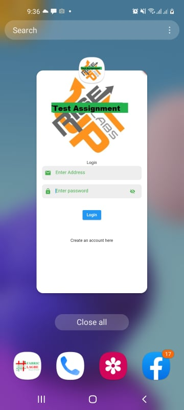
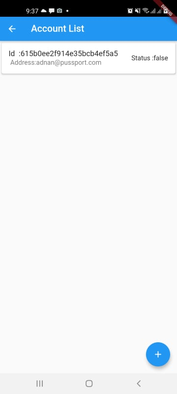
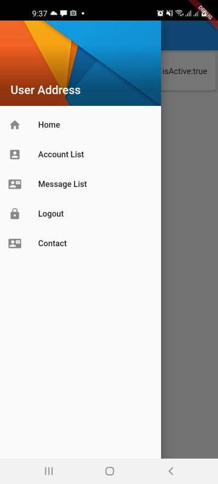
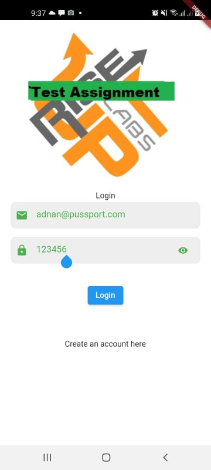
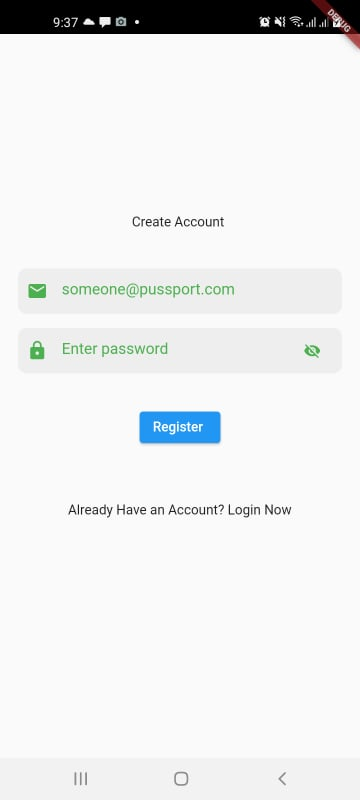

#  Test Assignment

## Login
   ### mail : adnan@pussport.com
   ### passowrd : 12345678 

* Query The Domain List [ /domains ]
> sampledomain.com

* Create an Account [ /accounts ]
> someone@sampledomain.com

* Login [ /token ]
> Get JWT Token [ Bearer ]

* Send an E-Mail to the created account [ from your e-mail ]
> you@gmail.com -> someone@sampledomain.com

* Check inbox [ /messages ]
> New mail from you@gmail.com

# Screenshot
  
 

# References

# Find Me On
- Facebook: 
- YouTube: 
- Website: 
- Number: +880 1831679008
- Email: adnanmorshed118@gmail.com
